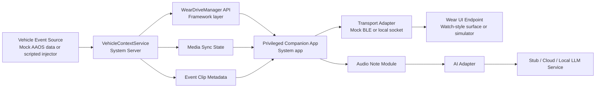
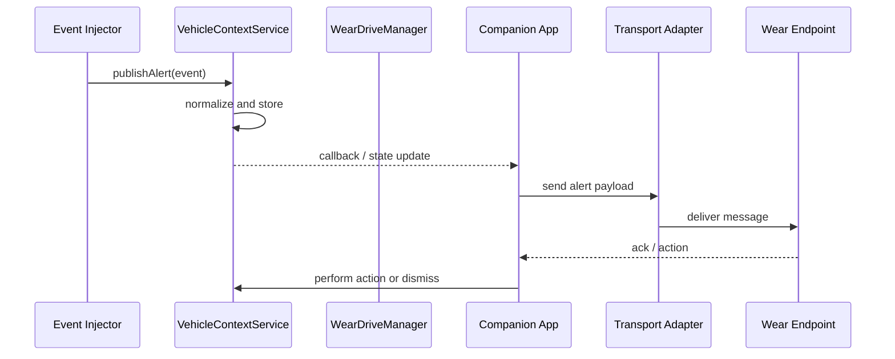
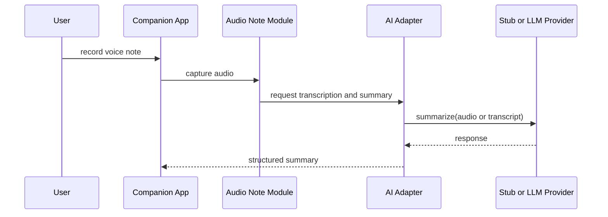

# WearDrive Companion Architecture

## 1. Scope

WearDrive Companion is a cross-device AOSP reference architecture connecting a vehicle-context Android platform service to a wearable companion experience.

## 2. Component View

## 3. AOSP Integration Boundaries

### Inside `aosp16`
- `frameworks/base/`:
  - AIDL definitions
  - manager class
  - service registration hooks
  - permissions and hidden API surface
- `frameworks/base/services/`:
  - `VehicleContextService`
  - policy handling
  - event store
- `packages/apps/`:
  - `WearDriveCompanion` privileged app
- product or device config:
  - package inclusion
  - permission XML
  - optional feature flags

### Outside `aosp16`
- architecture docs
- helper scripts
- standalone transport prototypes
- AI adapter experiments
- course content
- demo and recording plans

## 4. Main Runtime Flows

### Alert Sync Flow

### Audio Summary Flow

## 5. Feasibility Notes

### Feasible now
- service creation in AOSP 16
- system app with privileged permission model
- mock transport
- scripted event injection
- media and alert sync demo
- host-side AI service integration

### Simulated
- BLE pairing and radio behavior
- watch-specific UX constraints
- live dashcam or camera feeds

### Later with hardware
- real watch communication
- full Bluetooth validation
- real audio routing edge cases
- low-level power and radio performance testing
